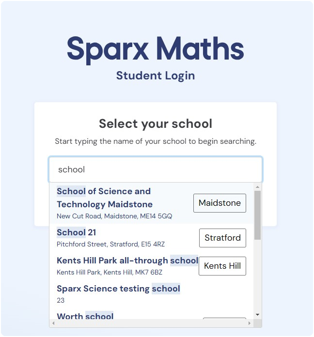
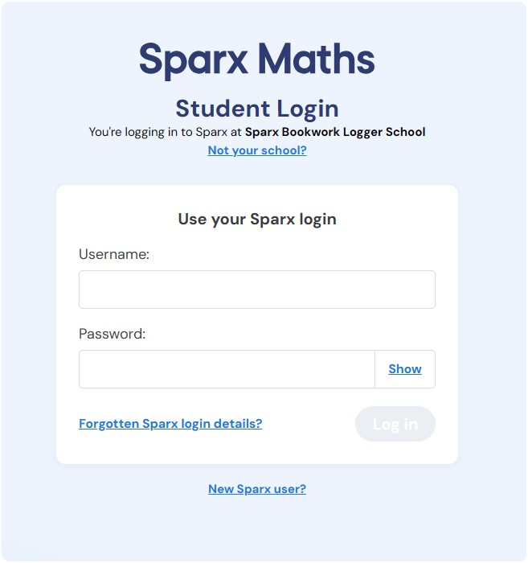
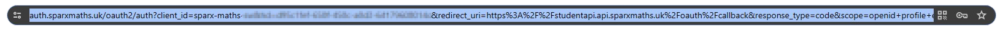
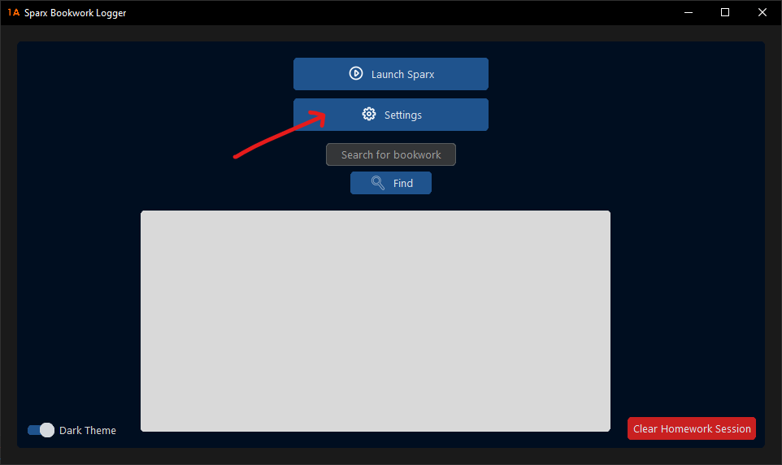
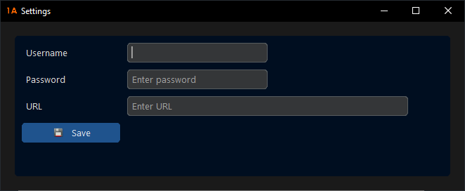
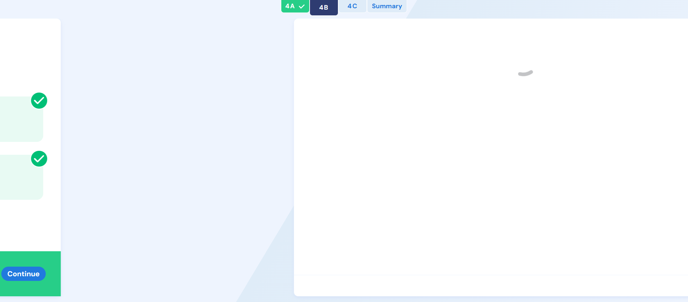

  
  <h1>Sparx Bookwork Logger</h1>
  
  

# Tired of bookwork checks? ✅

### This project was designed to minimise the effort you have to put in to your Sparx homework ✍

Getting simple questions and having to write them down question after question can get annoying. This program **automatically** takes a screenshot after every question and saves it to a folder.   Whenever a bookwork check comes up, it retrieves that image and displays it in the GUI.

Follow the quick and easy setup below to get started...

# Installation and Setup 🔧

This project currently only works on [Windows](https://www.microsoft.com/en-gb/windows) but a [Linux](https://en.wikipedia.org/wiki/Linux) application will be coming in the future.

## Installation (.exe)

**You will need to add an exception in your Antivirus software or [Windows Security](https://support.microsoft.com/en-us/windows/add-an-exclusion-to-windows-security-811816c0-4dfd-af4a-47e4-c301afe13b26) to .exe files (make sure to remove after installation) and/or this one specific .exe file.**

**Some useful links:**
- [Avast Antivirus Exception](https://support.avast.com/en-gb/article/antivirus-scan-exclusions/#pc)
- [Norton Antivirus Exception](https://support.norton.com/sp/en/us/home/current/solutions/v3672136)
- [Bitdefender Antivirus Exception](https://www.bitdefender.co.uk/consumer/support/answer/88779/)
- [TotalAV Antivirus Exception](https://help.bethesda.net/#en/answer/46189)
- [McAfee Antivirus Exception](https://www.mcafee.com/support/?articleId=TS102056&page=shell&shell=article-view)

**Main Installation:**
- Navigate to the [**latest release**](https://github.com/lmdrums/sparx-bookwork-logger/releases/latest)
- Download the **'Sparx Bookwork Logger.zip'** file
- **Add exception** (see above)
- **Extract** the file *(This may take a couple of minutes)*
- **Follow setup instructions below ⬇**
- **Do your maths homework!**

## Installation (Python)

**Ignore this section if you have installed and will use the .exe file (easiest)**

If you don't want the hassle of adding exceptions for .exe files and have a version of [Python 3.10+](https://www.python.org/), you can run a standalone .py file for this application

Firstly, clone the repository (alternatively download and extract the source code)

`git clone https://github.com/lmdrums/Sparx-Bookwork-Logger.git`

Now, change directories to the newly cloned repo

`cd Sparx-Bookwork-Logger`

Install all dependencies (using [pip](https://pip.pypa.io/en/stable/))

`pip3 install -r requirements.txt`

To run the application, run the command

`python3 run.py`

Alternatively, setup a [virtual environment](https://docs.python.org/3/library/venv.html) in your IDE and run from there

## Setup
- **Web Setup:**
  - Go to [Sparx Maths](https://selectschool.sparxmaths.uk/)
  - Enter your school and click Continue:
     
    
  - You should now be at a login page:
     
    
  - Copy the link of this page and keep hold of it for later:
     
    

- **App Setup:**

  - Navigate to the newly downloaded .exe file (see above)
  - Open the application
  - Go into 'Settings'
     
    
  - Type in your Sparx Username and Password in the corresponding boxes (these will be stored locally on your machine in a .env file)
  - Paste the URL you copied from earlier in the URL box
     
    
  - **Click Save to save your settings**
  - **Reload the application before starting to sync settings!**

### Now you're good to go! 🟢

After reloading, in the application, press **Launch Sparx** to begin *(Warning: this may take a while on the first launch if Chrome isn't already installed - a Chrome driver will be installed to your machine)*

You will be logged in automatically and you can begin your homework.

## Important Notes! (Please read) 📜

- Whenever you make **changes** to the **settings**, make sure to **reload** the application to sync your changes
- If you start **XP Boost** questions, be warned that if you're **still running** Sparx Bookwork Logger, the answers of these questions will **overwrite** previous images with the same code
  - Therefore, whenever you **finish** a homework session and **no more** bookwork checks can be asked about that session, it is recommended you click the *'Clear Homework Session'* button in the **application**
- If you have completed a question and got it **correct**, please make sure you **leave enough time** to let the application get a **screenshot** of your answer, if not you may get a screenshot which looks like this:
   
  
  - The application **will automatically** click the Continue button for you after a correct answer so you don't even need to press continue

---

# Credits ❤️

- A massive thank you to [Aritra (aritra-codes)](https://github.com/aritra-codes) for helping with some errors
- We would greatly appreciate it if you could support us by following us on GitHub and other socials

 | 
---|---
[Lewis M (lmdrums)](https://github.com/lmdrums) | [Aritra (aritra-codes)](https://github.com/aritra-codes)

- Another big thanks to [Tom Schimansky](https://github.com/TomSchimansky) with [CustomTkinter](https://github.com/TomSchimansky/CustomTkinter) for making the UI possible as always

---

### Any problems with this project, just let me know. 📪
